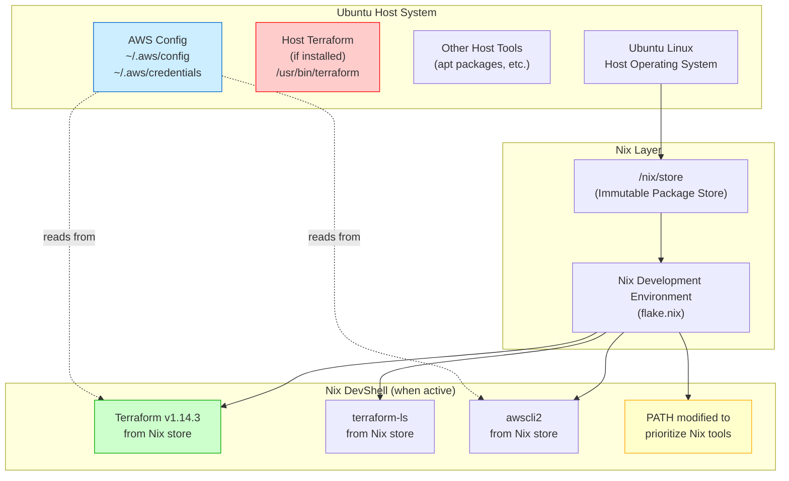

# terraform-nix-ubuntu-demo

Terraform development environment using Nix on Ubuntu.

## How Nix Works on Ubuntu

Nix creates an isolated development environment that runs on top of your Ubuntu system. Here's how the layers interact:



### Key Points

1. **Isolation**: When you run `nix develop`, Nix modifies your `PATH` to prioritize tools from the Nix store. This means:
   - The Nix-provided Terraform (v1.14.3) takes precedence over any host-installed Terraform
   - Your host Terraform remains untouched and unused while in the Nix environment
   - Each tool version is isolated in `/nix/store/` with a unique hash

2. **No Conflicts**:
   - Host Terraform (if installed via `apt` or other means) is not affected
   - The Nix environment only activates when you run `nix develop`
   - When you exit the shell, you return to using host tools

3. **Reproducibility**:
   - The exact versions are pinned in `flake.lock`
   - Same versions work identically across different Ubuntu systems
   - No need to manage versions manually with `apt` or `snap`

4. **File System**:
   - Nix packages are stored in `/nix/store/` (read-only, immutable)
   - Your project files and Terraform state remain in your workspace
   - Plugin cache uses `~/.terraform.d/plugin-cache` (shared location)
   - **AWS CLI configuration is shared**: The Nix-provided `awscli2` automatically uses your host's AWS config from `~/.aws/config` and `~/.aws/credentials`

### Checking Which Terraform You're Using

```bash
# Outside Nix environment (uses host Terraform if installed)
which terraform
terraform version

# Inside Nix environment (uses Nix Terraform)
nix develop
which terraform  # Shows /nix/store/.../terraform
terraform version  # Shows Terraform v1.14.3
```

### ASCII Diagram (Alternative View)

```text
┌─────────────────────────────────────────────────────────┐
│                    Ubuntu Host System                    │
│  ┌───────────────────────────────────────────────────┐  │
│  │  Host-installed Terraform (if present)            │  │
│  │  /usr/bin/terraform or /usr/local/bin/terraform   │  │
│  └───────────────────────────────────────────────────┘  │
└─────────────────────────────────────────────────────────┘
                          │
                          ▼
┌─────────────────────────────────────────────────────────┐
│                    Nix Package Manager                   │
│  ┌───────────────────────────────────────────────────┐  │
│  │  /nix/store/ (immutable, versioned packages)      │  │
│  │  - terraform-1.14.3                               │  │
│  │  - terraform-ls-0.38.3                            │  │
│  │  - awscli2-2.33.2                                 │  │
│  └───────────────────────────────────────────────────┘  │
└─────────────────────────────────────────────────────────┘
                          │
                          ▼
┌─────────────────────────────────────────────────────────┐
│            Nix Development Shell (nix develop)          │
│  ┌───────────────────────────────────────────────────┐  │
│  │  Modified PATH:                                   │  │
│  │  1. /nix/store/.../terraform/bin  ← Nix tools    │  │
│  │  2. /usr/bin                      ← Host tools   │  │
│  │  3. /usr/local/bin                                │  │
│  └───────────────────────────────────────────────────┘  │
│                                                          │
│  When you run 'terraform':                               │
│  ✓ Uses Nix version (isolated, reproducible)           │
│  ✗ Host Terraform is shadowed (not used)                │
└─────────────────────────────────────────────────────────┘
```

## Setup

1. Make sure you have Nix with flakes enabled installed on your Ubuntu system
2. Enter the development shell:

   ```bash
   nix develop
   ```

3. Initialize Terraform:

   ```bash
   terraform init
   ```

## AWS CLI Configuration

The Nix environment allows you to explicitly choose which AWS configuration to use. Both host (`~/.aws/`) and project (`.aws/`) configurations can coexist - you select which one to use.

### Option 1: Use Host Configuration (Default)

By default, the Nix-provided AWS CLI uses your host system's AWS configuration:

```bash
nix develop
# Uses ~/.aws/config and ~/.aws/credentials
```

- **No additional setup needed**: Your existing `~/.aws/config` and `~/.aws/credentials` files work automatically
- **Shared configuration**: Both host and Nix AWS CLI use the same profiles and credentials
- **Terraform integration**: Terraform's AWS provider will use the same credentials via the AWS SDK

### Option 2: Use Project-Specific Configuration

To use a project-specific AWS configuration:

1. Create a `.aws/` directory in your project root:

   ```bash
   mkdir -p .aws
   ```

2. Create your project-specific config files:

   ```bash
   # Create config file
   cat > .aws/config << EOF
   [default]
   region = ap-southeast-2
   output = json
   
   [profile project-dev]
   region = ap-southeast-2
   EOF
   
   # Create credentials file
   cat > .aws/credentials << EOF
   [default]
   aws_access_key_id = YOUR_ACCESS_KEY
   aws_secret_access_key = YOUR_SECRET_KEY
   
   [project-dev]
   aws_access_key_id = PROJECT_ACCESS_KEY
   aws_secret_access_key = PROJECT_SECRET_KEY
   EOF
   ```

3. **Important**: Add `.aws/` to `.gitignore` to avoid committing credentials:

   ```bash
   echo ".aws/" >> .gitignore
   ```

4. Set the environment variable to use project config:

   ```bash
   USE_PROJECT_AWS_CONFIG=1 nix develop
   ```

   Or export it before entering the shell:

   ```bash
   export USE_PROJECT_AWS_CONFIG=1
   nix develop
   ```

### Option 3: Custom Paths via Environment Variables

You can also set custom paths explicitly:

```bash
export AWS_CONFIG_FILE="/path/to/custom/config"
export AWS_SHARED_CREDENTIALS_FILE="/path/to/custom/credentials"
nix develop
```

### How It Works

**Default Behavior (Host Config):**

```text
┌─────────────────────────────────────────────────────────┐
│              Host System (~/.aws/)                        │
│  ┌───────────────────────────────────────────────────┐  │
│  │  ~/.aws/config      (profiles, regions)           │  │
│  │  ~/.aws/credentials (access keys, tokens)         │  │
│  └───────────────────────────────────────────────────┘  │
└─────────────────────────────────────────────────────────┘
                          │
                          │ (read by both)
                          ▼
┌─────────────────────────────────────────────────────────┐
│         Nix AWS CLI (from /nix/store/...)               │
│  ┌───────────────────────────────────────────────────┐  │
│  │  aws configure list                               │  │
│  │  aws s3 ls                                        │  │
│  │  (uses ~/.aws/config automatically)              │  │
│  └───────────────────────────────────────────────────┘  │
└─────────────────────────────────────────────────────────┘
```

**With Project-Specific Config (.aws/ in project root):**

```text
┌─────────────────────────────────────────────────────────┐
│              Project Root (.aws/)                         │
│  ┌───────────────────────────────────────────────────┐  │
│  │  .aws/config      (project-specific profiles)      │  │
│  │  .aws/credentials (project-specific credentials)  │  │
│  └───────────────────────────────────────────────────┘  │
└─────────────────────────────────────────────────────────┘
                          │
                          │ (AWS_CONFIG_FILE env var)
                          ▼
┌─────────────────────────────────────────────────────────┐
│         Nix AWS CLI (from /nix/store/...)               │
│  ┌───────────────────────────────────────────────────┐  │
│  │  Uses project-specific config (isolated)          │  │
│  │  Host ~/.aws/ is ignored                          │  │
│  └───────────────────────────────────────────────────┘  │
└─────────────────────────────────────────────────────────┘
```

**Selection Priority:**

1. `AWS_CONFIG_FILE` and `AWS_SHARED_CREDENTIALS_FILE` environment variables (if explicitly set)
2. Project `.aws/` directory (if `USE_PROJECT_AWS_CONFIG=1` is set)
3. Host `~/.aws/` directory (default when `USE_PROJECT_AWS_CONFIG` is not set)

### Verifying AWS Configuration

```bash
# Inside Nix environment
nix develop

# Check AWS CLI can access your config
aws configure list
aws sts get-caller-identity

# Test Terraform can use AWS
terraform init
terraform plan
```

## Features

- Terraform with latest version
- Terraform Language Server (terraform-ls) for IDE support
- AWS CLI v2 for AWS operations (uses host `~/.aws/` or project `.aws/` configuration)
- Plugin cache configured in `~/.terraform.d/plugin-cache`

## Optional Tools

You can uncomment additional tools in `flake.nix`:

- `kubectl` for Kubernetes operations
- `docker` for container management
